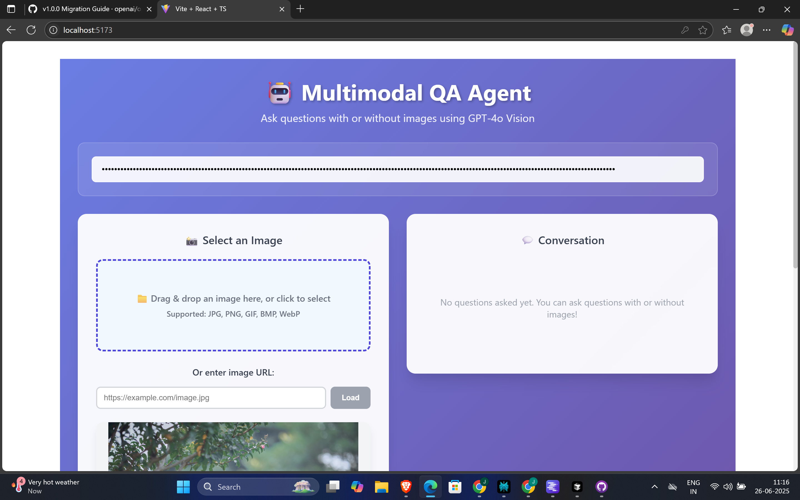
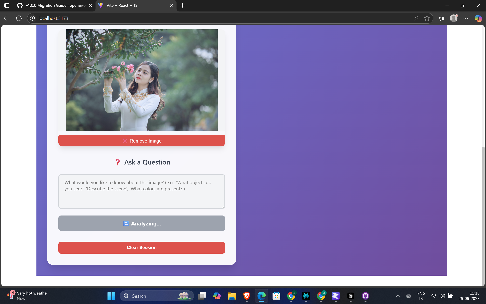
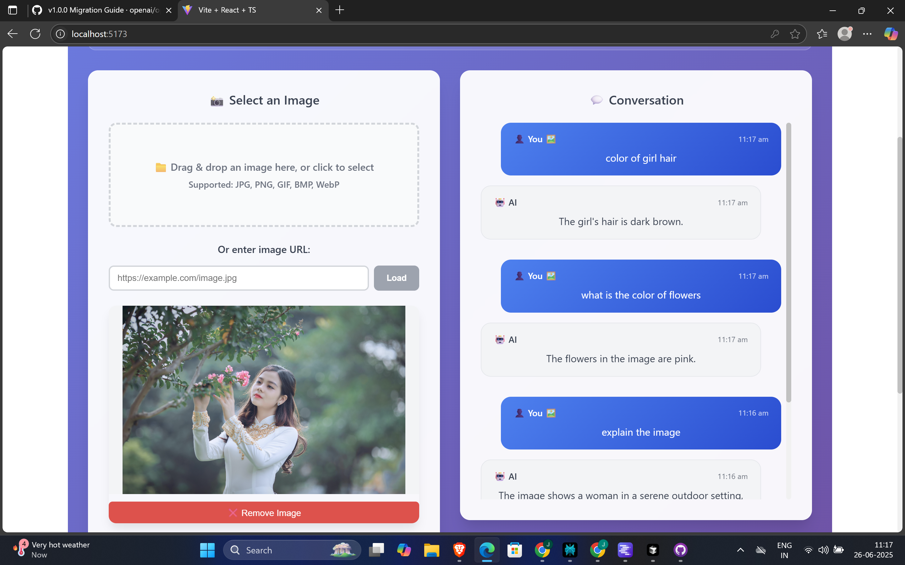

# 🤖 Multimodal QA Agent

A beautiful and modern web application that allows users to upload images and ask questions about them using GPT-4o Vision capabilities.

## 🌟 Features

- **Image Upload**: Drag & drop or click to upload images (JPG, PNG, GIF, BMP, WebP)
- **URL Support**: Load images directly from URLs
- **Natural Language Questions**: Ask any question about your uploaded images
- **Real-time Responses**: Get instant answers powered by GPT-4o Vision
- **Conversation History**: View all previous questions and answers
- **Beautiful UI**: Modern, responsive design with gradient backgrounds and smooth animations
- **Mobile Friendly**: Fully responsive design that works on all devices

## 🚀 Getting Started

### Prerequisites

- Node.js (v16 or higher)
- npm or yarn
- OpenAI API key with GPT-4o access

### Installation

1. **Clone or navigate to the project directory**
   ```bash
   cd q2
   ```

2. **Install dependencies**
   ```bash
   npm install
   ```

3. **Start the development server**
   ```bash
   npm run dev
   ```

4. **Open your browser** and navigate to the provided local URL (usually `http://localhost:5173`)

## 🔧 Usage

### 1. Enter Your API Key
- Enter your OpenAI API key in the password field at the top of the application
- Your API key is only stored locally in your browser session

### 2. Upload an Image
Choose one of two methods:
- **File Upload**: Drag and drop an image file or click the upload area to select one
- **URL**: Enter a direct image URL and click "Load"

### 3. Ask Questions
- Type your question in the text area
- Examples:
  - "What objects do you see in this image?"
  - "Describe the scene in detail"
  - "What colors are most prominent?"
  - "Are there any people in this image?"
  - "What's the weather like in this photo?"

### 4. View Responses
- Your questions and AI responses will appear in the conversation panel
- Each message includes a timestamp
- Scroll through the conversation history

### 5. Clear Session
- Click "Clear Session" to remove the current image and conversation history
- Upload a new image to start a fresh conversation

## 🎨 Features in Detail

### Image Support
- **Formats**: JPEG, JPG, PNG, GIF, BMP, WebP
- **Sources**: Local file upload or remote URLs
- **Preview**: Thumbnail preview of selected images
- **Validation**: Automatic format checking

### AI Capabilities
- **Vision Model**: GPT-4o with vision capabilities
- **Multi-turn**: Ask multiple questions about the same image
- **Context**: AI maintains context throughout the conversation
- **Detailed Responses**: Get comprehensive answers about image content

### User Experience
- **Drag & Drop**: Intuitive file upload interface
- **Real-time Feedback**: Loading states and progress indicators
- **Error Handling**: Clear error messages and validation
- **Responsive**: Works perfectly on desktop, tablet, and mobile

## 🛠️ Technical Stack

- **Frontend**: React 18 with TypeScript
- **Build Tool**: Vite
- **Styling**: CSS3 with modern features (Grid, Flexbox, Gradients)
- **File Upload**: react-dropzone
- **API**: OpenAI GPT-4o Vision API
- **Deployment**: Ready for any static hosting service

## 🔒 Privacy & Security

- **Local Processing**: API keys are only stored in your browser session
- **No Backend**: Direct browser-to-OpenAI communication
- **No Storage**: Images and conversations are not saved permanently
- **HTTPS**: Use secure connections when deployed

## 📱 Browser Support

- **Chrome**: Latest versions
- **Firefox**: Latest versions  
- **Safari**: Latest versions
- **Edge**: Latest versions

## 🎯 Example Use Cases

1. **Education**: Analyze historical photos, scientific diagrams, or artwork
2. **Accessibility**: Get detailed descriptions of images for visually impaired users
3. **Content Creation**: Generate captions and descriptions for social media
4. **Research**: Analyze data visualizations, charts, and graphs
5. **Personal**: Ask questions about family photos, travel pictures, or documents

## 🖼️ Screenshots

Below are example screenshots demonstrating the app in action:

1. **Home Screen & API Key Entry**
   - 
2. **Image Upload & Question**
   - 
3. **AI Response Display**
   - 

> _Replace the above image links with your own screenshots placed in `src/assets/` or another appropriate directory._

## 🤖 LLM APIs Used

This application uses the following OpenAI models:

- **GPT-4o**: Used for multimodal (image + text) questions. Chosen for its advanced vision and reasoning capabilities, enabling detailed analysis and description of images.
- **GPT-4o-mini**: Used for text-only questions. Selected for its speed and efficiency when image input is not required.

**Why these models?**
- GPT-4o provides state-of-the-art performance for both vision and language tasks, making it ideal for answering questions about images.
- GPT-4o-mini is a lightweight variant, reducing latency and cost for text-only queries.

## 🧪 Sample Outputs / Test Report

Below are three example image-question pairs and the AI's responses:

### 1. Image: A photo of a busy city street
**Question:** What objects do you see in this image?
**AI Response:**
> I see several cars, buses, and bicycles on the street. There are people walking on the sidewalks, traffic lights, and tall buildings in the background. Some trees and street signs are also visible.

### 2. Image: A bar chart showing sales data
**Question:** Which product had the highest sales?
**AI Response:**
> The product labeled "Product C" had the highest sales, as indicated by the tallest bar in the chart.

### 3. Image: A group photo of people at a beach
**Question:** How many people are in this image, and what are they doing?
**AI Response:**
> There are six people in the image. They appear to be smiling and posing for the photo, with some holding beach balls and others standing near the water. The weather looks sunny and pleasant.

> _You can generate your own test cases by uploading images and asking questions. The above are representative outputs._

## 🚧 Development

### Available Scripts

- `npm run dev` - Start development server
- `npm run build` - Build for production
- `npm run preview` - Preview production build
- `npm run lint` - Run ESLint

### Project Structure

```
q2/
├── src/
│   ├── components/
│   │   ├── ImageUpload.tsx      # Image upload component
│   │   ├── QuestionInput.tsx    # Question input form
│   │   └── ResponseDisplay.tsx  # Chat interface
│   ├── App.tsx                  # Main application
│   ├── App.css                  # Styles
│   └── main.tsx                 # Entry point
├── public/                      # Static assets
├── package.json                 # Dependencies
└── vite.config.ts              # Vite configuration
```

## 📄 License

This project is open source and available under the [MIT License](LICENSE).

## 🤝 Contributing

Contributions, issues, and feature requests are welcome! Feel free to check the issues page.

## 📞 Support

If you have any questions or need help, please:
1. Check the existing issues
2. Create a new issue with detailed information
3. Provide steps to reproduce any bugs

---

**Happy questioning!** 🎉
